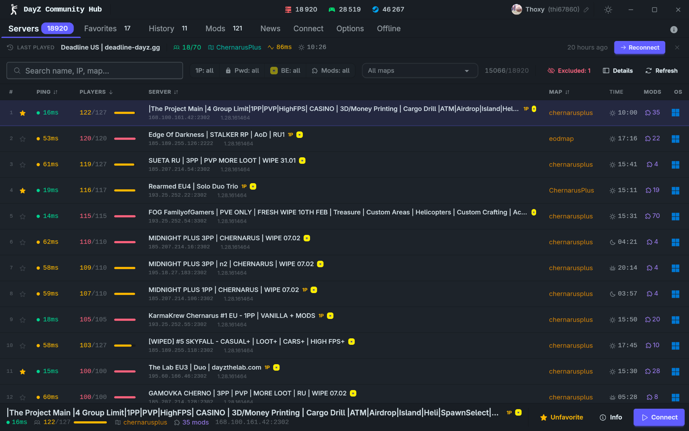

# DayZ Community Hub

[](https://git.thoxy.xyz/thoxy/dayz-community-hub/actions?workflow=ci.yml)
[](https://git.thoxy.xyz/thoxy/dayz-community-hub/actions?workflow=release.yml)
[](https://git.thoxy.xyz/thoxy/dayz-community-hub/releases)

[](LICENSE)

[](https://rust-lang.org/)
[](https://tauri.app/)
[](https://svelte.dev/)
[](https://www.typescriptlang.org/)
[](https://tailwindcss.com/)
[](https://daisyui.com/)

A desktop launcher for DayZ Standalone that replaces the official launcher with a faster, more complete experience — server browser, mod manager, and auto-updater in a single app.



---

## What it does

**Browse servers** — pulls the full public server list (~18 000 servers), lets you filter by map, mods, 1st-person, password, and BattleEye, and shows live ping for every server.

**Manage mods** — installs, updates, and removes Workshop mods through SteamCMD with a live progress feed. Missing mods for a server are detected automatically before you connect.

**Launch in one click** — picks up your launch options, sets up mod symlinks, starts Steam if needed, and connects directly to the server.

**Track your servers** — star favorites, browse your session history with timestamps, and reconnect to your last server from the top bar.

**BattleMetrics** — shows rank, status, country, uptime percentage, and a 24-hour player count graph per server (requires a free BattleMetrics API token).

**News** — latest articles from the official DayZ website, in-app.

**Direct connect** — join any server by IP and port without browsing the list.

**Offline mode** — installs and launches [DayZ Community Offline Mode](https://github.com/Arkensor/DayZCommunityOfflineMode) missions, with one-click save wipe.

**Auto-updater** — Windows only; checks for new releases and applies them in-place without reinstalling.

---

## Documentation

Full documentation is available in the [Wiki](https://git.thoxy.xyz/thoxy/dayz-community-hub/wiki) — setup guide, configuration reference, mod manager, architecture, and CI/CD details.

---

## Download

Go to [Releases](https://git.thoxy.xyz/thoxy/dayz-community-hub/releases) and grab the latest zip for your platform.

- **Windows** — extract and run `dayz-community-hub.exe`
- **Linux** — run the binary directly or install the `.deb` package
- **Arch Linux** — install via the AUR package [`dayz-community-hub-git`](https://git.thoxy.xyz/AUR/dayz-community-hub-git):

```bash
git clone https://git.thoxy.xyz/AUR/dayz-community-hub-git.git
cd dayz-community-hub-git
makepkg -si
```

---

## Building from source

**Prerequisites:** Rust (nightly), Bun, [Tauri v2 system deps](https://tauri.app/start/prerequisites/)

```bash
git clone https://git.thoxy.xyz/thoxy/dayz-community-hub
cd dayz-community-hub
bun install
bun tauri dev        # development
bun tauri build      # production
```

**Cross-compile for Windows from Linux** (requires [cargo-xwin](https://github.com/rust-cross/cargo-xwin)):

```bash
rustup target add x86_64-pc-windows-msvc
cargo install cargo-xwin
TAURI_SIGNING_PRIVATE_KEY="" bun tauri build \
  --runner cargo-xwin --target x86_64-pc-windows-msvc --no-bundle
```

---

## Tech stack

| | |
|---|---|
| [Tauri 2](https://tauri.app) | Desktop shell, native APIs, auto-updater |
| [SvelteKit 5](https://svelte.dev) | Frontend (runes, SPA mode) |
| [Rust](https://www.rust-lang.org) | All backend logic |
| [DaisyUI 5](https://daisyui.com) + [Tailwind 4](https://tailwindcss.com) | Styling |

---

## License

MIT — see [LICENSE](LICENSE)
